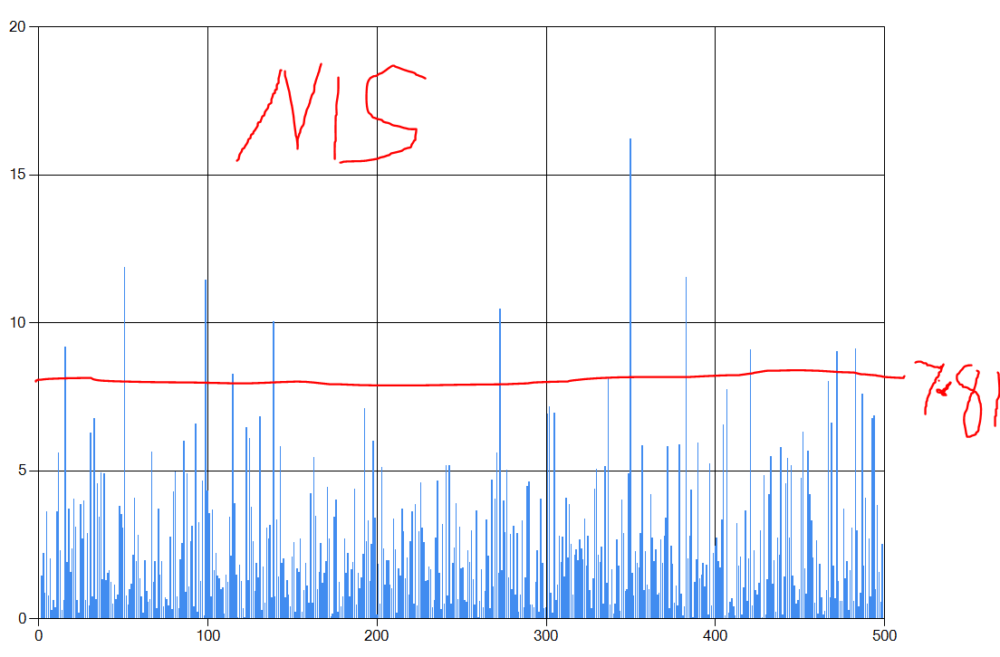

# Unscented Kalman Filter Project Starter Code
Self-Driving Car Engineer Nanodegree Program

---

## Dependencies

* cmake >= v3.5
* make >= v4.1
* gcc/g++ >= v5.4

## Basic Build Instructions

1. Clone this repo.
2. Make a build directory: `mkdir build && cd build`
3. Compile: `cmake .. && make`
4. Run it: `./UnscentedKF path/to/input.txt path/to/output.txt`. You can find
   some sample inputs in 'data/'.
    - eg. `./UnscentedKF ../data/obj_pose-laser-radar-synthetic-input.txt`

---

## Advanced Usage Notes

```./UnscentedKF path/to/input.txt path/to/output.txt [-v] [-a std_a] [-y std_yawdd] [-d] [-r] [-s [lr]]
OPTIONAL ARGUMENTS:
 [-v]           - verbose mode, print predicted and updated state after each sensor measurement
 [-a std_a]     - override std_a noise parameter
 [-y std_yawdd] - override std_yawdd noise parameter
 [-d]           - adjust noise parameters dynamically
 [-r]           - report std dev of estimated acceleration and yaw_dd
 [-s [lr]]      - sensor types to use: l=>lidar, r=>radar; both can be specified, which is default mode
 ```

## Project Rubric Data Files Specific Notes

* New dataset: "obj_pose-laser-radar-synthetic-input.txt" : 

    Rubric specifications met by simple default usage (assuming command shell in build directory):

    ```
    ./UnscentedKF ../data/obj_pose-laser-radar-synthetic-input.txt obj_pose-output.txt
    ```

    NIS plot (excluding the initial large NIS value):
    

* Older dataset 1: "sample-laser-radar-measurement-data-1.txt" : 

    This dataset has large variations and requires its own tuning for process noise parameters.  These can be specified on the command line:

    ```
    ./UnscentedKF ../data/sample-laser-radar-measurement-data-1.txt output-1.txt   -a .6 -y .6
    ```

* Older dataset 2: "sample-laser-radar-measurement-data-2.txt" : 

    Rubric specifications met by simple default usage:

    ```
    ./UnscentedKF ../data/sample-laser-radar-measurement-data-2.txt output-2.txt
    ```

## Help On Finding Optimal Parameters

Since the process noise follows standard deviation of longitudinal acceleration and yaw rate change, the program provides help to user to
iteratively find optimal values by optionally printing standard deviation of the two parameters from updated state values.  These values
should be verified if they actually improved RMSE or not.

```
./UnscentedKF ../data/sample-laser-radar-measurement-data-1.txt output-1.txt   -r
```

There is also an optional experimental mode to dynamically adjust the process noise. The UKF implemetation calculates standard deviation of 
the two parameters online with each measurement and adapts the process noise parameters.  Wild swings in acceleration or yaw rate change, 
only if the values are within 3 std dev (after measurement update) are taken into account for online update.  

This mode is invoked by specifying **-d** on the commandline.  This is sufficient to meet rubric criteria for all three datasets.

```
./UnscentedKF ../data/sample-laser-radar-measurement-data-1.txt output-1.txt   -d
```


---

## Editor Settings

We've purposefully kept editor configuration files out of this repo in order to
keep it as simple and environment agnostic as possible. However, we recommend
using the following settings:

* indent using spaces
* set tab width to 2 spaces (keeps the matrices in source code aligned)

## Code Style

Please stick to [Google's C++ style guide](https://google.github.io/styleguide/cppguide.html) as much as possible.

## Generating Additional Data

This is optional!

If you'd like to generate your own radar and lidar data, see the
[utilities repo](https://github.com/udacity/CarND-Mercedes-SF-Utilities) for
Matlab scripts that can generate additional data.

## Project Instructions and Rubric

This information is only accessible by people who are already enrolled in Term 2
of CarND. If you are enrolled, see [the project page](https://classroom.udacity.com/nanodegrees/nd013/parts/40f38239-66b6-46ec-ae68-03afd8a601c8/modules/0949fca6-b379-42af-a919-ee50aa304e6a/lessons/c3eb3583-17b2-4d83-abf7-d852ae1b9fff/concepts/f437b8b0-f2d8-43b0-9662-72ac4e4029c1)
for instructions and the project rubric.

